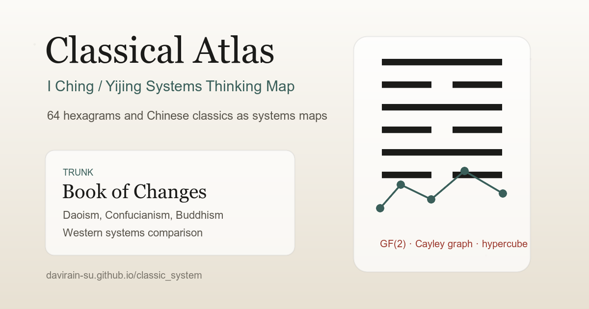

# Classical Atlas

[](https://github.com/DaviRain-Su/classic_system/actions/workflows/deploy.yml)


[](LICENSE)
[](CONTENT_LICENSE.md)

> An interactive I Ching / Yijing systems-thinking atlas that connects the Book of Changes with Daoist, Confucian, Buddhist, and Western systems traditions.

[English](README.md) | [简体中文](README.zh-CN.md)

Classical Atlas is a digital humanities and learning platform for Chinese classics. It treats the **I Ching** (also known as **Yijing**, **Zhouyi**, or the **Book of Changes**) as the structural trunk, then maps related Daoist, Confucian, Buddhist, and Western systems-thinking texts around it as an explorable knowledge network.

The project combines close reading, hexagram visualization, cross-text references, and mathematical structure. It is built as a static Astro + React application, with typed source data and no backend requirement.

Live demo: <https://yijing.davirain.xyz/>

Cloudflare Pages fallback: <https://classic-system.pages.dev/>

GitHub Pages mirror: <https://davirain-su.github.io/classic_system/>



## Why This Exists

The I Ching is not only a divination classic. It is also one of the earliest and most influential Chinese models of change, polarity, recursion, sequence, and relational thinking.

This repository explores that systems layer through:

- the **64 hexagrams** and the **eight trigrams** / **bagua**
- King Wen sequence, Fuxi sequence, changing lines, inverse/opposite hexagrams, and hexagram families
- textual layers such as the hexagram statements, line statements, Tuan Zhuan, Da Xiang, and Xiao Xiang
- links to Daoism, Confucianism, Buddhism, Neo-Confucian thought, and selected Western systems ideas
- mathematical parallels such as binary structure, **GF(2)**, **Cayley graphs**, and the six-dimensional hypercube

## Highlights

| Area | What is implemented |
|---|---|
| Network home | A star-map interface centered on the I Ching, with Daoist, Confucian, Buddhist, and Western branches. |
| Hexagram reading | Full 64-hexagram access with original Chinese text, Tuan, Da Xiang, line statements, Xiao Xiang, project-written plain-language glosses, changing-line simulation, and hexagram family navigation. |
| Rich model hexagrams | Qian, Kun, Tai, Pi, Jiji, and Weiji include more polished interactive line reading and commentary treatment. |
| Hexagram matrix | Searchable 8 x 8 matrix by hexagram name, number, upper trigram, and lower trigram. |
| 3D / graph views | Six-dimensional hypercube-inspired visualization with multiple projections, neighbor highlighting, and opposite-hexagram relationships. |
| Fuxi circle-square diagram | Outer circular Fuxi sequence and inner 8 x 8 square diagram. |
| Casting tool | Three-coin style hexagram casting with changing lines and resulting hexagram navigation. |
| Classical readings | Selected Daoist, Confucian, and Buddhist works with sentence-level reading, glosses, notes, and cross-links. |
| Western comparison branch | Original commentary comparing the I Ching with selected Western systems and philosophy references. |
| Search | Full-text search across the current corpus of Chinese classics and hexagram material. |
| Mobile reading mode | A dedicated narrow-screen layout focused on readable vertical navigation instead of shrinking the desktop canvas. |
| Shareable routes | Hash routes such as `#/hex/43`, `#/reading/xinjing`, and `#/cube` can be refreshed and shared. |

## Current Content Coverage

The interaction system is already broad, but the content layer is intentionally still growing.

Ready or substantially implemented:

- **I Ching / Zhouyi**: all 64 hexagrams include hexagram statements, line statements, Tuan Zhuan, Da Xiang, Xiao Xiang — each with project-written plain-language glosses (hexagram statement, lines, **and Tuan / Da Xiang / Xiao Xiang: 64 + 64 + 384 vernacular renderings**).
- **Line-position analysis**: each line shows centrality/correctness plus the classic relational reading — correspondence (Ying), riding/supported (Cheng / Sheng), and proximity (Bi) — computed from the six lines.
- **Detailed I Ching samples**: Qian, Kun, Tai, Pi, Ji Ji, and Wei Ji have the most complete polished reading experience.
- **Historical I Ching notes**: both hexagram-statement-level and **line-level** commentary from Cheng Yi (*Yichuan Yizhuan*) and Zhu Xi (*Zhouyi Benyi*) — 64/64 hexagrams at the statement level, plus all 386 lines/uses at the line level — drawn mainly from the imperial *Yuzuan Zhouyi Zhezhong*.
- **Ten Wings**: Tuan and Xiang are embedded per hexagram; Xici Zhuan (expanded), Wenyan, Shuo Gua, Xu Gua, and Za Gua are readable as cross-linked texts with vernacular glosses; the separate complete Ten Wings corpus is bundled for full-text reading and search, with full Wenyan Zhuan, Xici Shangzhuan, and Xici Xiazhuan glosses now layered into that corpus.
- **Daoist texts**: the complete Dao De Jing (81 chapters), expanded selected passages from all seven Zhuangzi inner chapters, Qingjing Jing, Yinfu Jing, and the opening of Zhouyi Cantong Qi.
- **Confucian texts**: Zhongyong, Taiji Tushuo, Ximing, Huangji Jingshi material, and Wang Yangming learning notes.
- **Buddhist texts**: Heart Sutra, Diamond Sutra, Vimalakirti non-duality passage, Verses on the Eight Consciousnesses, expanded selected Platform Sutra material across all ten traditional sections, selected Bodhicaryavatara material, and a Four Dharma Seals guide.
- **Western comparison**: original bibliographic and conceptual commentary only; no copyrighted Western source text is bundled.

Still expanding:

- deeper full-text coverage beyond the current Zhuangzi inner-chapter and Platform Sutra selections
- deeper Dao De Jing sentence-level notes and historical commentary
- remaining full-corpus Ten Wings glosses beyond the completed Wenyan Zhuan and Xici Zhuan layers
- stronger search ranking, pinyin search, fuzzy matching, and sentence-level deep linking

## Tech Stack

- [Astro](https://astro.build) 5
- [React](https://react.dev) 19 via `@astrojs/react`
- TypeScript
- Static site output, no backend, no database
- Typed local data modules for classics, hexagrams, graph nodes, glossary terms, and comparison notes
- Cloudflare Pages deployment support at the root path, plus GitHub Pages support under `/classic_system`

## Getting Started

```bash
pnpm install
pnpm dev
```

The local development server defaults to:

```text
http://localhost:4321
```

Useful commands:

```bash
pnpm check      # Astro + TypeScript checks
pnpm verify     # content and hexagram structure verification
pnpm build      # production build into dist/
pnpm deploy:cloudflare # build and upload dist/ to Cloudflare Pages
pnpm preview    # preview the production build
```

This repository declares `pnpm@10.33.0` in `package.json`. If your local pnpm version is older, either upgrade pnpm or temporarily run commands with:

```bash
pnpm --config.package-manager-strict=false check
```

## Project Structure

```text
src/components/atlas/
├─ App.tsx              # application shell, hash routing, layout switching, theme state
├─ StarMap.tsx          # network home
├─ Reading.tsx          # hexagram, sentence, and chapter reading views
├─ Matrix.tsx           # 64-hexagram matrix and single-hexagram entry
├─ Cube.tsx             # hypercube / graph projections
├─ CircleSquare.tsx     # Fuxi circle-square diagram
├─ cast.tsx             # hexagram casting tool
├─ Search.tsx           # corpus search
├─ Relations.tsx        # cross-text relation map
├─ Mobile.tsx           # mobile-first reading layout
├─ data.ts              # core classics, works registry, graph nodes, glossary, comparisons
├─ hex.ts               # 64-hexagram table and transformations
├─ hex-rest.ts          # generated 64-hexagram source text supplement
├─ hex-gloss.ts         # project-written hexagram glosses
├─ jizhu.ts             # generated historical I Ching commentary data
└─ progress.ts          # local reading progress and bookmarks
```

## Shareable Routes

The app uses hash routes so individual views can be shared even when deployed as a static site:

```text
#/hex/1
#/hex/43
#/reading/daode
#/reading/xinjing
#/matrix
#/cube
#/circle
#/cast
#/west
#/search
#/relations
#/learn/5.1
```

## Search And Discovery Terms

This project is relevant to readers and researchers looking for:

I Ching, Yijing, Zhouyi, Book of Changes, Chinese classics, Chinese philosophy, Daoism, Taoism, Confucianism, Buddhism, Neo-Confucianism, Chinese systems thinking, divination, 64 hexagrams, bagua, eight trigrams, King Wen sequence, Fuxi sequence, Ten Wings, Xici Zhuan, hexagram visualization, digital humanities, knowledge graph, Astro React TypeScript static site, GF(2), Cayley graph, binary philosophy, and hypercube visualization.

For GitHub repository topics, good candidates are:

```text
i-ching
yijing
zhouyi
book-of-changes
chinese-classics
chinese-philosophy
daoism
taoism
confucianism
buddhism
digital-humanities
knowledge-graph
systems-thinking
hexagrams
interactive-i-ching
astro
react
typescript
static-site
```

## Roadmap

- Maintain the English and Chinese READMEs in parallel.
- Add a real screenshot gallery and short interaction clips.
- Expand the I Ching commentary layer from hexagram-level notes to line-level notes.
- Deepen Dao De Jing, Zhuangzi, Platform Sutra, and Ten Wings commentary coverage.
- Split the growing data layer into domain modules as the corpus expands.
- Add stronger search: pinyin lookup, fuzzy matching, ranking, and sentence-level route anchors.
- Improve accessibility with more semantic controls, labels, and keyboard navigation.
- Add export/import for bookmarks and reading progress.
- Add print styles and optional offline / PWA support.

## Contributing And Citation

- Contribution guide: [CONTRIBUTING.md](CONTRIBUTING.md)
- Citation metadata: [CITATION.cff](CITATION.cff)
- Code license: [MIT](LICENSE)
- Content license and source policy: [CONTENT_LICENSE.md](CONTENT_LICENSE.md)

## Sources And Copyright

Chinese classical source texts used here are public-domain materials. The 64-hexagram corpus is assembled from public-domain/open repositories and processed by local build scripts:

- `scripts/build_hex.mjs` composes hexagram and line text from [openqt/gua](https://github.com/openqt/gua) and Tuan / Xiang material from [bollwarm/ZHOUYI](https://github.com/bollwarm/ZHOUYI), with Traditional-to-Simplified conversion through [opencc-js](https://github.com/nk2028/opencc-js).
- `scripts/build_ten_wings.mjs` extracts the complete Ten Wings source text from [bollwarm/ZHOUYI](https://github.com/bollwarm/ZHOUYI), also converted through `opencc-js`; project-written full-corpus glosses are layered separately in `src/components/atlas/ten-wing-gloss.ts`, currently covering complete Wenyan Zhuan and Xici Zhuan layers plus selected Ten Wings passages elsewhere in the app.
- `scripts/build_jizhu.mjs` assembles public-domain historical commentary — Zhu Xi's *Zhouyi Benyi* and Cheng Yi's *Yichuan Yizhuan*, at both hexagram-statement and line level — mainly from the imperial *Yuzuan Zhouyi Zhezhong* (御纂周易折中, Qing dynasty; held in the [garychowcmu/daizhigev20](https://github.com/garychowcmu/daizhigev20) Daizhige corpus). A few gaps in that OCR (Hexagram 24's statement-level Benyi and Hexagram 1's line-5 notes) are filled from *Zhouyi Benyi Tongshi* and *Yichuan Yizhuan*.
- Plain-language hexagram glosses and Western comparison notes are original project material.
- The interface was iterated with assistance from Claude Design.

Please verify source editions before using this project for scholarly citation. The current goal is an interactive reading and systems-thinking atlas, not a critical academic edition.
